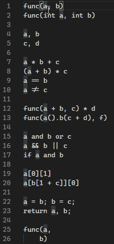

# Any Swap For VS Code

Swap parameters, lines, even complicated expressions from current cursor.

Behaves just like `Move-Element-Left/Right` in IntelliJ's IDEs, but more intelligently.
It is based on a general Abstract-Syntax-Tree (AST) analyzer that enables user to swap expressions recursively while maintaining a correct operator precedence.

## Commands

```
alt+[: anySwap.backward
alt+]: anySwap.forward
```

## Features

Place your cursor `|` on the begin/end of a word/paren, then trigger the command to swap things.



## Release Notes

### 0.1.0

First publish.
